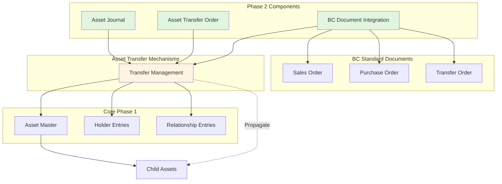
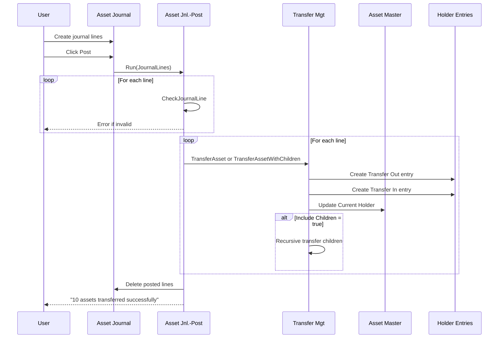
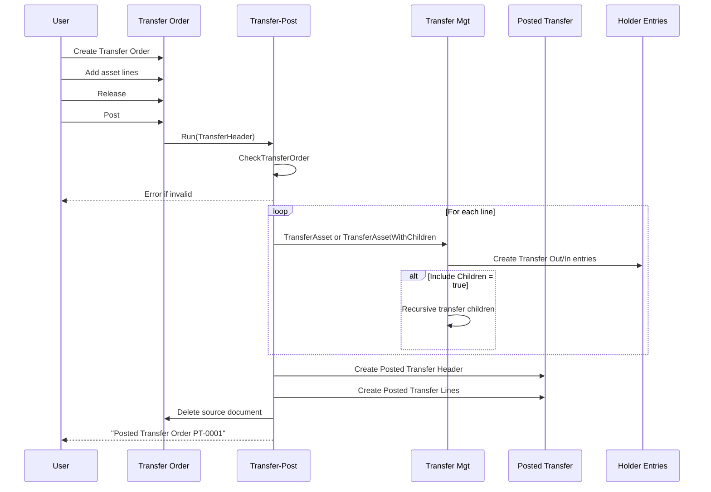
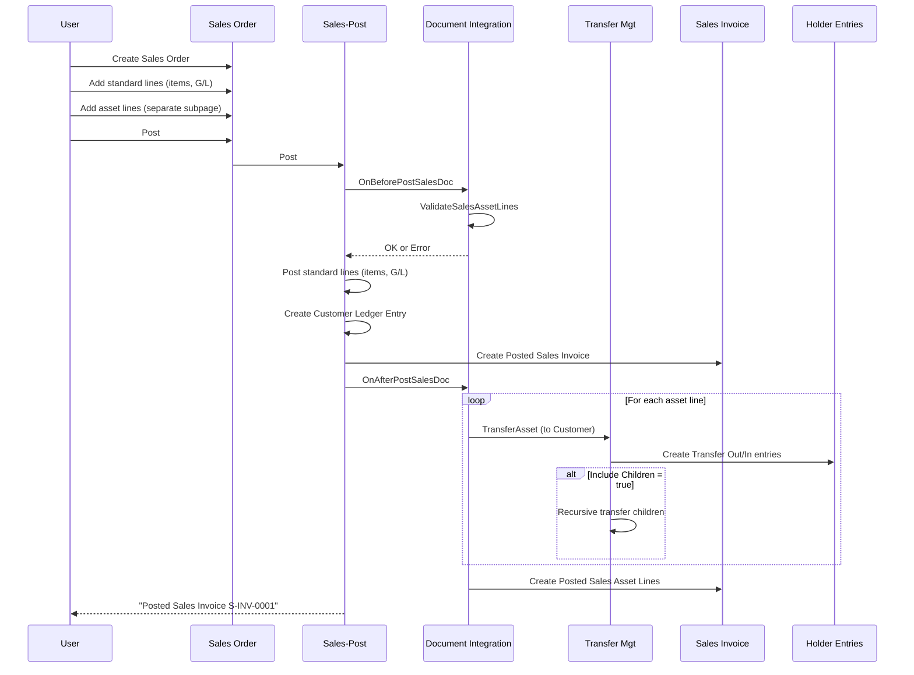
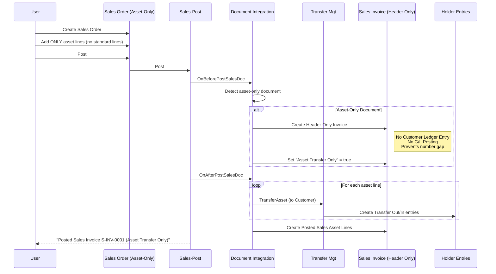
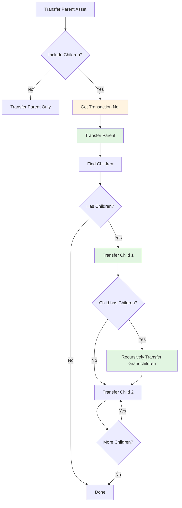
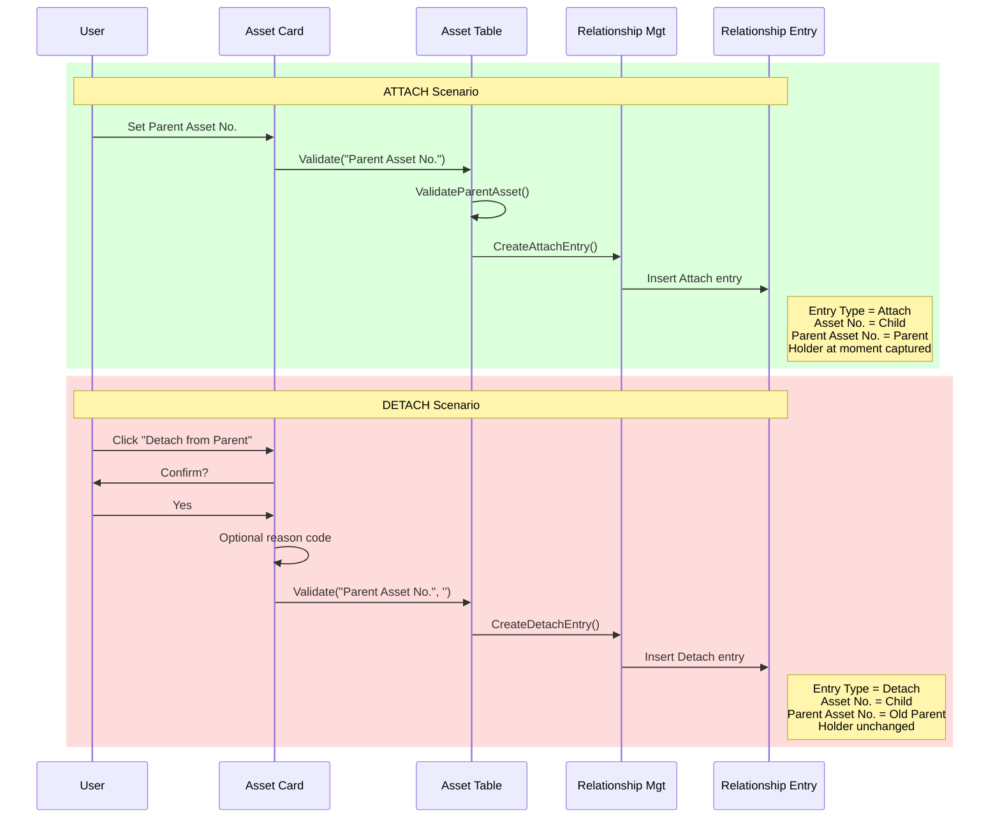

# Asset Pro - Phase 2 Analysis and Planning Document

**Project:** Asset Pro - Multi-Industry Asset Management for Business Central
**Phase:** Phase 2 - Asset Transfer and Document Integration
**Publisher:** JEMEL
**Date:** 2025-11-15
**Status:** Architecture Approved - Ready for Implementation
**Workflow Mode:** Analysis (Relaxed)

---

## Executive Summary

Phase 2 extends the Asset Pro foundation (Phase 1) with comprehensive asset transfer capabilities and deep integration with Business Central standard documents. This phase enables complete asset lifecycle management through journals, dedicated transfer documents, and native BC document workflows.

### Phase 1 Foundation Recap

Phase 1 delivered:
- ✅ Asset master table with unlimited classification hierarchy
- ✅ Parent-child asset relationships (physical composition)
- ✅ Current holder tracking (Customer, Vendor, Location)
- ✅ Holder entry ledger with Transfer Out/Transfer In pattern
- ✅ Manual transfer management codeunit
- ✅ Custom attribute framework

### Phase 2 Objectives

Phase 2 adds:
1. **Asset Journal** - Batch-based asset holder transfers (like General Journal)
2. **Asset Transfer Order** - Dedicated document for asset movements with full document workflow
3. **BC Document Integration** - Asset lines on Sales Orders, Purchase Orders, Transfer Orders
4. **Automatic Subasset Propagation** - Moving parent automatically moves all children
5. **Parent-Child Relationship Tracking** - Audit trail of attach/detach events
6. **Zero-Amount Posting** - Support asset-only documents without financial transactions

### Key Innovation: Dual Transfer Mechanisms

Asset Pro Phase 2 provides TWO ways to transfer assets, each optimized for different scenarios:

| Mechanism | Use Case | Example |
|-----------|----------|---------|
| **Asset Transfer Order** | Pure asset movements | Internal transfers between locations |
| **BC Document Integration** | Asset movements with business transactions | Selling asset to customer via Sales Order |

This dual approach ensures Asset Pro integrates seamlessly with BC workflows (warehouse picking, shipping, approval) while maintaining clean separation of asset and financial transactions.

---

## Requirements Analysis

### Phase 2 Requirements (from User)

#### R1: Asset Journal (MUST)
**Business Need:** Register manual asset holder changes in batch operations.

**Functional Requirements:**
- Batch-based journal lines (like General Journal)
- No journal templates (simplified structure)
- Post multiple asset transfers in single operation
- Create holder entries and update asset master
- Support all holder types (Customer, Vendor, Location)
- Reversing entries deferred to future phase

**Validation Rules:**
- Asset must exist and not be blocked
- New holder must be different from current holder
- New holder code must exist in respective table
- Posting date cannot be in future
- Cannot transfer subasset independently (must detach first)

#### R2: Asset Transfer Order (MUST)
**Business Need:** Document-based asset transfers with audit trail and workflow support.

**Functional Requirements:**
- Header/Lines document structure
- Support unlimited assets per document
- From Holder → To Holder pattern
- Single-step posting (no ship/receive for now)
- Posted document archive with complete history
- Include/exclude subassets per line (user choice at line level)
- Status flow: Open → Released → Posted
- Document numbering with no gaps

**Validation Rules:**
- Document must be Released before posting
- All assets must be valid and not blocked
- From Holder must match asset's current holder
- To Holder must be different from From Holder
- Cannot post empty document (must have lines)

**Future Enhancement (Phase 3+):**
- Approval workflow integration
- Ship/Receive steps (like BC Transfer Order)

#### R3: BC Document Integration (MUST)
**Business Need:** Transfer assets within standard BC business processes (Sales, Purchasing, Transfers).

**Functional Requirements:**
- Separate asset line tables (not mixed with standard lines)
- Asset lines on Sales Orders, Purchase Orders, Transfer Orders
- Post assets automatically when document posts
- Support asset-only documents (no financial lines)
- Block document posting if asset transfer fails
- Leverage BC warehouse/picking workflows
- Posted asset lines linked to Posted documents

**Key Scenarios:**
- **Sales Order with assets:** Sell equipment to customer, asset holder changes to customer
- **Purchase Order with assets:** Acquire equipment from vendor, asset holder changes from vendor to our location
- **Transfer Order with assets:** Move assets between locations (alternative to Asset Transfer Order)
- **Asset-only Sales Order:** Use Sales Order workflow (picking, shipping) for asset transfer without financial transaction

**Zero-Amount Posting:**
When document has only asset lines (no standard lines):
- Create Posted document header (prevent numbering gaps)
- Skip Customer/Vendor Ledger entries
- Skip G/L posting
- Only create asset holder entries
- Pattern: Similar to BC "Deleted" sales invoice header

#### R4: Automatic Subasset Propagation (MUST)
**Business Need:** Maintain data consistency - child assets must follow parent asset location.

**Functional Requirements:**
- Automatic propagation (no user choice to skip)
- Unlimited recursion depth (no artificial limit)
- Prevent circular references (already implemented in Phase 1)
- Each asset gets separate holder entry (full audit trail)
- Transaction No. links parent and children transfers

**Business Logic:**
```
Transfer Vehicle (Parent) to Customer A
  → Automatically transfer Engine (Child) to Customer A
    → Automatically transfer Turbocharger (Grandchild) to Customer A
      → Continue recursively for all descendants
```

**Exception:** To transfer child independently, user must first **Detach** it from parent.

#### R5: Parent-Child Relationship Tracking (MUST)
**Business Need:** Audit trail of asset composition changes over time.

**Functional Requirements:**
- Log every Attach event (asset becomes child of parent)
- Log every Detach event (asset freed from parent)
- Capture holder information at moment of attach/detach
- Reason code supported (optional)
- Answer historical questions: "What components were in Vehicle V-001 on 2024-01-15?"

**Use Cases:**
- Audit: "When was this engine installed in the vehicle?"
- Compliance: "Track component history for regulated equipment"
- Analysis: "How long do components typically stay in parent assets?"

#### R6: Subasset Movement Restriction (MUST)
**Business Need:** Prevent data inconsistency from independent child asset movements.

**Functional Requirements:**
- **Hard block:** Cannot transfer asset with Parent Asset No. populated
- Error message: "Cannot transfer subasset [Asset No.]. It is attached to parent [Parent No.]. Detach first."
- **Detach action:** Button on Asset Card to clear Parent Asset No.
- Detach requires optional reason code
- Detach creates Relationship Entry (type = Detach)
- After detach, asset can be transferred independently
- Re-attach supported (sets Parent Asset No., creates Relationship Entry type = Attach)

---

## Proposed Architecture

### Overview Diagram



---

### Component 1: Asset Journal

#### Architecture Pattern
Follows standard BC journal pattern (General Journal, Item Journal):
- Batch → Lines → Post

#### Tables

**Table 70182309 "JML AP Asset Journal Batch"**
```al
fields
{
    field(1; "Name"; Code[10]) { PK }
    field(2; "Description"; Text[100]) { }
    field(10; "No. Series"; Code[20]) { TableRelation = "No. Series"; }
    field(11; "Posting No. Series"; Code[20]) { TableRelation = "No. Series"; }
    field(20; "Reason Code"; Code[10]) { TableRelation = "Reason Code"; }
    // Default reason code for new lines
}
```

**Table 70182310 "JML AP Asset Journal Line"**
```al
fields
{
    field(1; "Journal Batch Name"; Code[10]) { PK, TableRelation = "JML AP Asset Journal Batch"; }
    field(2; "Line No."; Integer) { PK }

    field(10; "Posting Date"; Date) { NotBlank = true; }
    field(11; "Document No."; Code[20]) { }
    field(12; "External Document No."; Code[35]) { }

    field(20; "Asset No."; Code[20])
    {
        TableRelation = "JML AP Asset";
        trigger OnValidate()
        {
            // Get current holder, description
            // Validate asset not blocked
            // Check not already on unposted journal/document
        }
    }
    field(21; "Asset Description"; Text[100]) { Editable = false; }

    field(30; "Current Holder Type"; Enum "JML AP Holder Type") { Editable = false; }
    field(31; "Current Holder Code"; Code[20]) { Editable = false; }
    field(32; "Current Holder Name"; Text[100]) { Editable = false; }

    field(40; "New Holder Type"; Enum "JML AP Holder Type")
    {
        trigger OnValidate() { "New Holder Code" := ''; }
    }
    field(41; "New Holder Code"; Code[20])
    {
        TableRelation = if ("New Holder Type" = const(Customer)) Customer."No."
                        else if ("New Holder Type" = const(Vendor)) Vendor."No."
                        else if ("New Holder Type" = const(Location)) Location.Code;
        trigger OnValidate() { UpdateNewHolderName(); }
    }
    field(42; "New Holder Name"; Text[100]) { Editable = false; }

    field(50; "Reason Code"; Code[10]) { TableRelation = "Reason Code"; }
    field(51; "Description"; Text[100]) { }

    field(60; "Include Children"; Boolean)
    {
        Caption = 'Include Subassets';
        InitValue = true;
    }
}

keys
{
    key(PK; "Journal Batch Name", "Line No.") { Clustered = true; }
    key(Asset; "Asset No.") { }
}
```

#### Pages

**Page 70182351 "JML AP Asset Journal Batches"**
- List page showing all batches
- Actions: New, Delete, Edit Journal
- Navigate to journal lines

**Page 70182352 "JML AP Asset Journal"**
- List page with batch selector at top
- Columns: Posting Date, Asset No., Description, Current Holder, New Holder, Reason Code
- Actions:
  - Post
  - Post and Print
  - Test Report
  - Suggest Transfers (future enhancement)

#### Posting Codeunit

**Codeunit 70182390 "JML AP Asset Jnl.-Post"**

**Procedure: Run(var AssetJournalLine: Record "JML AP Asset Journal Line")**
```al
procedure Run(var AssetJournalLine: Record "JML AP Asset Journal Line")
begin
    // 1. Check lines
    CheckJournalLines(AssetJournalLine);

    // 2. Get line count for progress
    LineCount := AssetJournalLine.Count;

    // 3. Post each line
    if AssetJournalLine.FindSet() then
        repeat
            PostJournalLine(AssetJournalLine);
        until AssetJournalLine.Next() = 0;

    // 4. Delete posted lines
    AssetJournalLine.DeleteAll(true);

    Message(PostingCompleteMsg, LineCount);
end;

local procedure CheckJournalLines(var AssetJournalLine: Record "JML AP Asset Journal Line")
begin
    // Validate all lines before posting any
    if AssetJournalLine.FindSet() then
        repeat
            CheckJournalLine(AssetJournalLine);
        until AssetJournalLine.Next() = 0;
end;

local procedure CheckJournalLine(AssetJournalLine: Record "JML AP Asset Journal Line")
var
    Asset: Record "JML AP Asset";
begin
    // Posting Date required
    if AssetJournalLine."Posting Date" = 0D then
        Error(PostingDateRequiredErr, AssetJournalLine."Line No.");

    // Asset must exist
    if not Asset.Get(AssetJournalLine."Asset No.") then
        Error(AssetNotFoundErr, AssetJournalLine."Asset No.");

    // Asset not blocked
    if Asset.Blocked then
        Error(AssetBlockedErr, Asset."No.");

    // Cannot transfer subasset
    if Asset."Parent Asset No." <> '' then
        Error(CannotTransferSubassetErr, Asset."No.", Asset."Parent Asset No.");

    // New holder different from current
    if (Asset."Current Holder Type" = AssetJournalLine."New Holder Type") and
       (Asset."Current Holder Code" = AssetJournalLine."New Holder Code") then
        Error(AlreadyAtHolderErr, Asset."No.");

    // New holder exists
    ValidateHolderExists(AssetJournalLine."New Holder Type", AssetJournalLine."New Holder Code");
end;

local procedure PostJournalLine(AssetJournalLine: Record "JML AP Asset Journal Line")
var
    Asset: Record "JML AP Asset";
    AssetTransferMgt: Codeunit "JML AP Transfer Mgt";
begin
    Asset.Get(AssetJournalLine."Asset No.");

    if AssetJournalLine."Include Children" then
        AssetTransferMgt.TransferAssetWithChildren(
            Asset,
            AssetJournalLine."New Holder Type",
            AssetJournalLine."New Holder Code",
            "JML AP Document Type"::Manual,
            AssetJournalLine."Document No.",
            AssetJournalLine."Reason Code")
    else
        AssetTransferMgt.TransferAsset(
            Asset,
            AssetJournalLine."New Holder Type",
            AssetJournalLine."New Holder Code",
            "JML AP Document Type"::Manual,
            AssetJournalLine."Document No.",
            AssetJournalLine."Reason Code");
end;
```

---

### Component 2: Asset Transfer Order

#### Architecture Pattern
Follows BC Transfer Order pattern:
- Header/Lines document
- Status: Open → Released → Posted
- Posted document archive

#### Tables

**Table 70182311 "JML AP Asset Transfer Header"**
```al
fields
{
    field(1; "No."; Code[20]) { PK }
    field(2; "No. Series"; Code[20]) { TableRelation = "No. Series"; Editable = false; }

    field(10; "Posting Date"; Date) { }
    field(11; "Document Date"; Date) { }
    field(12; "Transfer Date"; Date) { }

    field(20; "From Holder Type"; Enum "JML AP Holder Type")
    {
        trigger OnValidate() { ValidateFromHolder(); }
    }
    field(21; "From Holder Code"; Code[20])
    {
        TableRelation = if ("From Holder Type" = const(Customer)) Customer."No."
                        else if ("From Holder Type" = const(Vendor)) Vendor."No."
                        else if ("From Holder Type" = const(Location)) Location.Code;
        trigger OnValidate() { UpdateFromHolderName(); }
    }
    field(22; "From Holder Name"; Text[100]) { Editable = false; }

    field(30; "To Holder Type"; Enum "JML AP Holder Type")
    {
        trigger OnValidate() { "To Holder Code" := ''; }
    }
    field(31; "To Holder Code"; Code[20])
    {
        TableRelation = if ("To Holder Type" = const(Customer)) Customer."No."
                        else if ("To Holder Type" = const(Vendor)) Vendor."No."
                        else if ("To Holder Type" = const(Location)) Location.Code;
        trigger OnValidate() { UpdateToHolderName(); }
    }
    field(32; "To Holder Name"; Text[100]) { Editable = false; }

    field(40; "External Document No."; Code[35]) { }
    field(41; "Reason Code"; Code[10]) { TableRelation = "Reason Code"; }

    field(50; "Status"; Enum "JML AP Transfer Status")
    {
        // Open, Released, Posted
        Editable = false;
    }

    field(60; "Posting No. Series"; Code[20]) { TableRelation = "No. Series"; }
    field(61; "Posting No."; Code[20]) { Editable = false; }
}

keys
{
    key(PK; "No.") { Clustered = true; }
    key(Status; "Status", "Posting Date") { }
}

trigger OnInsert()
begin
    InitializeHeader();
end;

trigger OnDelete()
begin
    if Status <> Status::Open then
        Error(CannotDeleteReleasedErr);
    DeleteLines();
end;
```

**Table 70182312 "JML AP Asset Transfer Line"**
```al
fields
{
    field(1; "Document No."; Code[20]) { PK, TableRelation = "JML AP Asset Transfer Header"; }
    field(2; "Line No."; Integer) { PK }

    field(10; "Asset No."; Code[20])
    {
        TableRelation = "JML AP Asset";
        trigger OnValidate()
        {
            GetAssetInfo();
            ValidateAssetEligible();
        }
    }
    field(11; "Asset Description"; Text[100]) { Editable = false; }
    field(12; "Asset Current Holder Type"; Enum "JML AP Holder Type") { Editable = false; }
    field(13; "Asset Current Holder Code"; Code[20]) { Editable = false; }

    field(20; "Include Children"; Boolean)
    {
        Caption = 'Include Subassets';
        InitValue = true;
    }
    field(21; "Child Asset Count"; Integer) { Editable = false; }

    field(30; "Description"; Text[100]) { }
    field(31; "Reason Code"; Code[10]) { TableRelation = "Reason Code"; }
}

keys
{
    key(PK; "Document No.", "Line No.") { Clustered = true; }
    key(Asset; "Asset No.") { }
}
```

**Table 70182313 "JML AP Posted Asset Transfer"**
Same fields as Header, plus:
- field(100; "Posted By"; Code[50])
- field(101; "Posted At"; DateTime)

**Table 70182314 "JML AP Posted Asset Trans. Line"**
Same fields as Line

**Enum 70182407 "JML AP Transfer Status"**
```al
enum 70182407 "JML AP Transfer Status"
{
    Extensible = true;

    value(0; Open) { Caption = 'Open'; }
    value(1; Released) { Caption = 'Released'; }
    value(2; Posted) { Caption = 'Posted'; }
}
```

#### Pages

**Page 70182353 "JML AP Asset Transfer Orders"**
- List page showing all transfer orders
- Filters by Status
- Actions: New, Edit, Release, Reopen, Post

**Page 70182354 "JML AP Asset Transfer Order"**
- Document page (Header + Lines)
- Actions:
  - Release / Reopen
  - Post
  - Print
  - Navigate
- FactBoxes: Asset details, Holder history

**Page 70182355 "JML AP Asset Transfer Subpage"**
- ListPart for lines
- Columns: Asset No., Description, Current Holder, Include Children, Child Asset Count

**Page 70182356 "JML AP Asset Posted Transfers"**
- List page showing posted transfer orders
- Navigate to Posted Transfer Order

**Page 70182357 "JML AP Asset Posted Transfer"**
- Document page (Posted Header + Posted Lines)
- Read-only
- Navigate to Holder Entries

**Page 70182358 "JML AP Asset Posted Trans. Sub"**
- ListPart for posted lines

#### Posting Codeunit

**Codeunit 70182391 "JML AP Asset Transfer-Post"**

```al
procedure Run(var AssetTransferHeader: Record "JML AP Asset Transfer Header")
begin
    CheckTransferOrder(AssetTransferHeader);
    PostTransferOrder(AssetTransferHeader);
end;

local procedure CheckTransferOrder(AssetTransferHeader: Record "JML AP Asset Transfer Header")
var
    AssetTransferLine: Record "JML AP Asset Transfer Line";
begin
    // Must be Released
    if AssetTransferHeader.Status <> AssetTransferHeader.Status::Released then
        Error(MustBeReleasedErr);

    // Must have lines
    AssetTransferLine.SetRange("Document No.", AssetTransferHeader."No.");
    if AssetTransferLine.IsEmpty then
        Error(NoLinesErr);

    // Validate all lines
    if AssetTransferLine.FindSet() then
        repeat
            CheckTransferLine(AssetTransferHeader, AssetTransferLine);
        until AssetTransferLine.Next() = 0;
end;

local procedure CheckTransferLine(AssetTransferHeader: Record "JML AP Asset Transfer Header"; AssetTransferLine: Record "JML AP Asset Transfer Line")
var
    Asset: Record "JML AP Asset";
begin
    Asset.Get(AssetTransferLine."Asset No.");

    // Asset at From Holder
    if (Asset."Current Holder Type" <> AssetTransferHeader."From Holder Type") or
       (Asset."Current Holder Code" <> AssetTransferHeader."From Holder Code") then
        Error(AssetNotAtFromHolderErr, Asset."No.", AssetTransferHeader."From Holder Name");

    // Asset not blocked
    if Asset.Blocked then
        Error(AssetBlockedErr, Asset."No.");

    // Cannot transfer subasset
    if Asset."Parent Asset No." <> '' then
        Error(CannotTransferSubassetErr, Asset."No.", Asset."Parent Asset No.");
end;

local procedure PostTransferOrder(var AssetTransferHeader: Record "JML AP Asset Transfer Header")
var
    PostedHeader: Record "JML AP Posted Asset Transfer";
    AssetTransferLine: Record "JML AP Asset Transfer Line";
    AssetTransferMgt: Codeunit "JML AP Transfer Mgt";
    Asset: Record "JML AP Asset";
    PostingNo: Code[20];
begin
    // Get posting number
    PostingNo := GetPostingNo(AssetTransferHeader);

    // Post each line
    AssetTransferLine.SetRange("Document No.", AssetTransferHeader."No.");
    if AssetTransferLine.FindSet() then
        repeat
            Asset.Get(AssetTransferLine."Asset No.");

            if AssetTransferLine."Include Children" then
                AssetTransferMgt.TransferAssetWithChildren(
                    Asset,
                    AssetTransferHeader."To Holder Type",
                    AssetTransferHeader."To Holder Code",
                    "JML AP Document Type"::"Transfer Order",
                    PostingNo,
                    AssetTransferLine."Reason Code")
            else
                AssetTransferMgt.TransferAsset(
                    Asset,
                    AssetTransferHeader."To Holder Type",
                    AssetTransferHeader."To Holder Code",
                    "JML AP Document Type"::"Transfer Order",
                    PostingNo,
                    AssetTransferLine."Reason Code");

            // Create posted line
            CreatePostedLine(PostingNo, AssetTransferLine);
        until AssetTransferLine.Next() = 0;

    // Create posted header
    CreatePostedHeader(AssetTransferHeader, PostingNo);

    // Delete source document
    AssetTransferLine.DeleteAll(true);
    AssetTransferHeader.Delete(true);

    // Commit
    Commit();

    Message(PostingCompleteMsg, PostingNo);
end;
```

---

### Component 3: BC Document Integration

#### Architecture Pattern
Separate asset line tables linked to standard BC headers:
- JML AP Sales Asset Line → Sales Header
- JML AP Purchase Asset Line → Purchase Header
- JML AP Transfer Asset Line → Transfer Header

Asset lines post in parallel with standard document posting.

#### Tables

**Table 70182316 "JML AP Sales Asset Line"**
```al
fields
{
    field(1; "Document Type"; Enum "Sales Document Type") { PK }
    field(2; "Document No."; Code[20])
    {
        PK;
        TableRelation = "Sales Header"."No." where("Document Type" = field("Document Type"));
    }
    field(3; "Line No."; Integer) { PK }

    field(10; "Asset No."; Code[20])
    {
        TableRelation = "JML AP Asset";
        trigger OnValidate()
        {
            GetAssetInfo();
            ValidateAssetEligible();
        }
    }
    field(11; "Asset Description"; Text[100]) { Editable = false; }
    field(12; "Current Holder Type"; Enum "JML AP Holder Type") { Editable = false; }
    field(13; "Current Holder Code"; Code[20]) { Editable = false; }

    field(20; "Include Children"; Boolean)
    {
        Caption = 'Include Subassets';
        InitValue = true;
    }
    field(21; "Child Asset Count"; Integer) { Editable = false; }

    field(30; "Reason Code"; Code[10]) { TableRelation = "Reason Code"; }
    field(31; "Description"; Text[100]) { }

    field(40; "Sell-to Customer No."; Code[20]) { Editable = false; }
    // For validation - asset goes to this customer
}

keys
{
    key(PK; "Document Type", "Document No.", "Line No.") { Clustered = true; }
    key(Asset; "Asset No.") { }
}

trigger OnInsert()
begin
    GetSalesHeaderInfo();
end;

trigger OnDelete()
begin
    CheckCanDelete();
end;

local procedure GetSalesHeaderInfo()
var
    SalesHeader: Record "Sales Header";
begin
    if SalesHeader.Get("Document Type", "Document No.") then begin
        "Sell-to Customer No." := SalesHeader."Sell-to Customer No.";
    end;
end;
```

**Table 70182317 "JML AP Posted Sales Asset Line"**
Same structure, but linked to Sales Invoice Header and Sales Cr.Memo Header

**Table 70182318 "JML AP Purch. Asset Line"**
Similar to Sales Asset Line, for Purchase documents

**Table 70182319 "JML AP Posted Purch. Asset Line"**
Posted purchase asset lines

**Table 70182320 "JML AP Transfer Asset Line"**
Asset lines for Transfer Orders

**Table 70182321 "JML AP Posted Transfer Asset Line"**
Posted transfer asset lines

#### Page Extensions

**PageExtension 70182435 "JML AP Sales Order Ext" extends "Sales Order"**
```al
layout
{
    addafter(SalesLines)
    {
        part(AssetLines; "JML AP Sales Asset Subpage")
        {
            Caption = 'Asset Lines';
            SubPageLink = "Document Type" = field("Document Type"),
                          "Document No." = field("No.");
            ApplicationArea = All;
        }
    }
}

actions
{
    addlast(processing)
    {
        action(ShowAssetTransfers)
        {
            Caption = 'Asset Transfers';
            ToolTip = 'View asset holder entries created from this sales order.';
            Image = Navigate;
            ApplicationArea = All;

            trigger OnAction()
            var
                HolderEntry: Record "JML AP Holder Entry";
            begin
                HolderEntry.SetRange("Document Type", HolderEntry."Document Type"::"Sales Order");
                HolderEntry.SetRange("Document No.", Rec."No.");
                Page.Run(Page::"JML AP Holder Entries", HolderEntry);
            end;
        }
    }
}
```

**Similar extensions for:**
- Sales Invoice (70182436)
- Purchase Order (70182437)
- Purchase Invoice (70182438)
- Transfer Order (70182439)
- Posted Sales Invoice (70182440)
- Posted Purchase Invoice (70182441)
- Posted Transfer Receipt (70182442)

#### Subpages

**Page 70182359 "JML AP Sales Asset Subpage"**
- ListPart page for Sales Asset Lines
- Columns: Asset No., Description, Current Holder, Include Children, Reason Code

**Similar subpages for:**
- Posted Sales Asset Subpage (70182360)
- Purchase Asset Subpage (70182361)
- Posted Purchase Asset Subpage (70182362)
- Transfer Asset Subpage (70182363)
- Posted Transfer Asset Subpage (70182364)

#### Document Integration Codeunit

**Codeunit 70182392 "JML AP Document Integration"**

This codeunit subscribes to BC posting events and handles asset line posting.

```al
// === SALES ORDER INTEGRATION ===

[EventSubscriber(ObjectType::Codeunit, Codeunit::"Sales-Post", 'OnBeforePostSalesDoc', '', false, false)]
local procedure OnBeforePostSalesDoc(var SalesHeader: Record "Sales Header"; var IsHandled: Boolean)
begin
    ValidateSalesAssetLines(SalesHeader);
end;

[EventSubscriber(ObjectType::Codeunit, Codeunit::"Sales-Post", 'OnAfterCheckSalesDoc', '', false, false)]
local procedure OnAfterCheckSalesDoc(var SalesHeader: Record "Sales Header")
begin
    CheckSalesAssetLinesCanBePosted(SalesHeader);
end;

[EventSubscriber(ObjectType::Codeunit, Codeunit::"Sales-Post", 'OnAfterPostSalesDoc', '', false, false)]
local procedure OnAfterPostSalesDoc(var SalesHeader: Record "Sales Header"; var SalesInvHeader: Record "Sales Invoice Header"; var SalesCrMemoHeader: Record "Sales Cr.Memo Header"; var ReturnReceiptHeader: Record "Return Receipt Header"; var SalesShptHeader: Record "Sales Shipment Header")
begin
    PostSalesAssetLines(SalesHeader, SalesInvHeader, SalesCrMemoHeader);
end;

local procedure ValidateSalesAssetLines(SalesHeader: Record "Sales Header")
var
    SalesAssetLine: Record "JML AP Sales Asset Line";
    Asset: Record "JML AP Asset";
begin
    SalesAssetLine.SetRange("Document Type", SalesHeader."Document Type");
    SalesAssetLine.SetRange("Document No.", SalesHeader."No.");

    if SalesAssetLine.FindSet() then
        repeat
            Asset.Get(SalesAssetLine."Asset No.");

            // Validate asset not blocked
            if Asset.Blocked then
                Error(AssetBlockedErr, Asset."No.");

            // Validate asset not subasset
            if Asset."Parent Asset No." <> '' then
                Error(CannotTransferSubassetErr, Asset."No.", Asset."Parent Asset No.");

            // Validate not on another document
            CheckAssetNotOnOtherDocument(Asset."No.", SalesHeader."Document Type", SalesHeader."No.");
        until SalesAssetLine.Next() = 0;
end;

local procedure CheckSalesAssetLinesCanBePosted(SalesHeader: Record "Sales Header")
var
    SalesAssetLine: Record "JML AP Sales Asset Line";
begin
    // This runs after all BC validations
    // Final check: Can we transfer these assets?

    SalesAssetLine.SetRange("Document Type", SalesHeader."Document Type");
    SalesAssetLine.SetRange("Document No.", SalesHeader."No.");

    if SalesAssetLine.FindSet() then
        repeat
            CheckAssetTransferPossible(SalesAssetLine."Asset No.", SalesHeader."Sell-to Customer No.");
        until SalesAssetLine.Next() = 0;
end;

local procedure PostSalesAssetLines(SalesHeader: Record "Sales Header"; SalesInvHeader: Record "Sales Invoice Header"; SalesCrMemoHeader: Record "Sales Cr.Memo Header")
var
    SalesAssetLine: Record "JML AP Sales Asset Line";
    Asset: Record "JML AP Asset";
    AssetTransferMgt: Codeunit "JML AP Transfer Mgt";
    PostedDocNo: Code[20];
    NewHolderType: Enum "JML AP Holder Type";
    NewHolderCode: Code[20];
begin
    // Determine posted document number
    if SalesInvHeader."No." <> '' then
        PostedDocNo := SalesInvHeader."No."
    else if SalesCrMemoHeader."No." <> '' then
        PostedDocNo := SalesCrMemoHeader."No."
    else
        exit; // No posted document created

    // Determine new holder (Customer)
    NewHolderType := NewHolderType::Customer;
    NewHolderCode := SalesHeader."Sell-to Customer No.";

    // Post each asset line
    SalesAssetLine.SetRange("Document Type", SalesHeader."Document Type");
    SalesAssetLine.SetRange("Document No.", SalesHeader."No.");

    if SalesAssetLine.FindSet() then
        repeat
            Asset.Get(SalesAssetLine."Asset No.");

            if SalesAssetLine."Include Children" then
                AssetTransferMgt.TransferAssetWithChildren(
                    Asset,
                    NewHolderType,
                    NewHolderCode,
                    "JML AP Document Type"::"Sales Order",
                    PostedDocNo,
                    SalesAssetLine."Reason Code")
            else
                AssetTransferMgt.TransferAsset(
                    Asset,
                    NewHolderType,
                    NewHolderCode,
                    "JML AP Document Type"::"Sales Order",
                    PostedDocNo,
                    SalesAssetLine."Reason Code");

            // Create posted asset line
            CreatePostedSalesAssetLine(SalesAssetLine, PostedDocNo);
        until SalesAssetLine.Next() = 0;

    // Delete source asset lines
    SalesAssetLine.DeleteAll(true);
end;

// === PURCHASE ORDER INTEGRATION ===

[EventSubscriber(ObjectType::Codeunit, Codeunit::"Purch.-Post", 'OnBeforePostPurchaseDoc', '', false, false)]
local procedure OnBeforePostPurchaseDoc(var PurchaseHeader: Record "Purchase Header")
begin
    ValidatePurchaseAssetLines(PurchaseHeader);
end;

[EventSubscriber(ObjectType::Codeunit, Codeunit::"Purch.-Post", 'OnAfterPostPurchaseDoc', '', false, false)]
local procedure OnAfterPostPurchaseDoc(var PurchaseHeader: Record "Purchase Header"; var PurchInvHeader: Record "Purch. Inv. Header"; var PurchCrMemoHeader: Record "Purch. Cr. Memo Hdr.")
begin
    PostPurchaseAssetLines(PurchaseHeader, PurchInvHeader, PurchCrMemoHeader);
end;

// Similar pattern as Sales Order

// === TRANSFER ORDER INTEGRATION ===

[EventSubscriber(ObjectType::Codeunit, Codeunit::"TransferOrder-Post Receipt", 'OnBeforeTransferOrderPostReceipt', '', false, false)]
local procedure OnBeforeTransferOrderPostReceipt(var TransferHeader: Record "Transfer Header")
begin
    ValidateTransferAssetLines(TransferHeader);
end;

[EventSubscriber(ObjectType::Codeunit, Codeunit::"TransferOrder-Post Receipt", 'OnAfterTransferOrderPostReceipt', '', false, false)]
local procedure OnAfterTransferOrderPostReceipt(var TransferHeader: Record "Transfer Header"; var TransferReceiptHeader: Record "Transfer Receipt Header")
begin
    PostTransferAssetLines(TransferHeader, TransferReceiptHeader);
end;

// Similar pattern as Sales/Purchase
```

#### Zero-Amount Posting Handling

**Challenge:** Sales Order with ONLY asset lines (no standard lines) → No G/L posting, no Customer Ledger Entry.

**Solution:** Follow BC pattern for "Deleted" invoices:
1. Create Posted Sales Invoice Header (prevent number gaps)
2. Skip Customer Ledger Entry creation
3. Skip G/L posting
4. Only create Asset Holder Entries

**Implementation:**

```al
[EventSubscriber(ObjectType::Codeunit, Codeunit::"Sales-Post", 'OnBeforeCreatePostedDeferralSchedule', '', false, false)]
local procedure OnBeforeCreatePostedDeferralSchedule(var SalesHeader: Record "Sales Header"; var SalesInvoiceHeader: Record "Sales Invoice Header")
var
    SalesLine: Record "Sales Line";
    SalesAssetLine: Record "JML AP Sales Asset Line";
    HasStandardLines: Boolean;
    HasAssetLines: Boolean;
begin
    // Check if document has only asset lines
    SalesLine.SetRange("Document Type", SalesHeader."Document Type");
    SalesLine.SetRange("Document No.", SalesHeader."No.");
    SalesLine.SetFilter(Type, '<>%1', SalesLine.Type::" ");
    HasStandardLines := not SalesLine.IsEmpty;

    SalesAssetLine.SetRange("Document Type", SalesHeader."Document Type");
    SalesAssetLine.SetRange("Document No.", SalesHeader."No.");
    HasAssetLines := not SalesAssetLine.IsEmpty;

    // If only asset lines (no standard lines), create header-only invoice
    if HasAssetLines and (not HasStandardLines) then begin
        CreateHeaderOnlyInvoice(SalesHeader, SalesInvoiceHeader);
        // This prevents standard posting from creating ledger entries
    end;
end;

local procedure CreateHeaderOnlyInvoice(SalesHeader: Record "Sales Header"; var SalesInvoiceHeader: Record "Sales Invoice Header")
begin
    // Create Posted Sales Invoice Header without lines
    SalesInvoiceHeader.TransferFields(SalesHeader);
    SalesInvoiceHeader."No." := GetNextInvoiceNo(SalesHeader);
    SalesInvoiceHeader.Insert(true);

    // Mark as "Asset Transfer Only" for reporting
    // (Custom field added via extension)
    SalesInvoiceHeader."JML AP Asset Transfer Only" := true;
    SalesInvoiceHeader.Modify();
end;
```

**Table Extension for Posted Documents:**

```al
tableextension 70182425 "JML AP Sales Inv. Header Ext" extends "Sales Invoice Header"
{
    fields
    {
        field(70182300; "JML AP Asset Transfer Only"; Boolean)
        {
            Caption = 'Asset Transfer Only';
            ToolTip = 'Specifies that this invoice contains only asset transfers (no financial transaction).';
            DataClassification = CustomerContent;
            Editable = false;
        }
    }
}
```

---

### Component 4: Automatic Subasset Propagation

#### Enhanced Transfer Management

**Codeunit 70182385 "JML AP Transfer Mgt"** (Enhanced)

Add new procedure for recursive transfer:

```al
/// <summary>
/// Transfers an asset and all its children recursively.
/// </summary>
procedure TransferAssetWithChildren(
    var Asset: Record "JML AP Asset";
    NewHolderType: Enum "JML AP Holder Type";
    NewHolderCode: Code[20];
    DocumentType: Enum "JML AP Document Type";
    DocumentNo: Code[20];
    ReasonCode: Code[10]): Boolean
var
    ChildAsset: Record "JML AP Asset";
    TransactionNo: Integer;
begin
    // Validate transfer
    ValidateTransfer(Asset, NewHolderType, NewHolderCode);

    // Get shared transaction number for parent and all children
    TransactionNo := GetNextTransactionNo();

    // Transfer parent asset
    TransferAssetInternal(Asset, NewHolderType, NewHolderCode, TransactionNo, DocumentType, DocumentNo, ReasonCode);

    // Find and transfer all children recursively
    ChildAsset.SetRange("Parent Asset No.", Asset."No.");
    if ChildAsset.FindSet() then
        repeat
            TransferAssetWithChildrenInternal(
                ChildAsset,
                NewHolderType,
                NewHolderCode,
                TransactionNo,
                DocumentType,
                DocumentNo,
                ReasonCode);
        until ChildAsset.Next() = 0;

    exit(true);
end;

local procedure TransferAssetWithChildrenInternal(
    var Asset: Record "JML AP Asset";
    NewHolderType: Enum "JML AP Holder Type";
    NewHolderCode: Code[20];
    TransactionNo: Integer;
    DocumentType: Enum "JML AP Document Type";
    DocumentNo: Code[20];
    ReasonCode: Code[10])
var
    ChildAsset: Record "JML AP Asset";
begin
    // Transfer this asset (using provided transaction number)
    TransferAssetInternal(Asset, NewHolderType, NewHolderCode, TransactionNo, DocumentType, DocumentNo, ReasonCode);

    // Recursively transfer children
    ChildAsset.SetRange("Parent Asset No.", Asset."No.");
    if ChildAsset.FindSet() then
        repeat
            TransferAssetWithChildrenInternal(
                ChildAsset,
                NewHolderType,
                NewHolderCode,
                TransactionNo,
                DocumentType,
                DocumentNo,
                ReasonCode);
        until ChildAsset.Next() = 0;
end;

local procedure TransferAssetInternal(
    var Asset: Record "JML AP Asset";
    NewHolderType: Enum "JML AP Holder Type";
    NewHolderCode: Code[20];
    TransactionNo: Integer;
    DocumentType: Enum "JML AP Document Type";
    DocumentNo: Code[20];
    ReasonCode: Code[10])
begin
    // Create Transfer Out entry
    CreateTransferOutEntry(Asset, TransactionNo, DocumentType, DocumentNo, ReasonCode);

    // Create Transfer In entry
    CreateTransferInEntry(Asset, NewHolderType, NewHolderCode, TransactionNo, DocumentType, DocumentNo, ReasonCode);

    // Update asset current holder
    UpdateAssetHolder(Asset, NewHolderType, NewHolderCode);
end;
```

**Benefits:**
- Unlimited recursion depth (no artificial limit)
- Circular references already prevented by Phase 1 validation
- All transfers in family share Transaction No. (easy to trace)
- Each asset gets separate holder entries (full audit trail)

---

### Component 5: Parent-Child Relationship Tracking

#### New Table

**Table 70182315 "JML AP Asset Relationship Entry"**
```al
fields
{
    field(1; "Entry No."; Integer)
    {
        Caption = 'Entry No.';
        AutoIncrement = true;
    }

    field(10; "Asset No."; Code[20])
    {
        Caption = 'Asset No.';
        ToolTip = 'Specifies the child asset number.';
        TableRelation = "JML AP Asset";
        NotBlank = true;
    }
    field(11; "Asset Description"; Text[100])
    {
        Caption = 'Asset Description';
        FieldClass = FlowField;
        CalcFormula = Lookup("JML AP Asset".Description where("No." = field("Asset No.")));
        Editable = false;
    }

    field(20; "Parent Asset No."; Code[20])
    {
        Caption = 'Parent Asset No.';
        ToolTip = 'Specifies the parent asset number (empty for Detach entry).';
        TableRelation = "JML AP Asset";
    }
    field(21; "Parent Asset Description"; Text[100])
    {
        Caption = 'Parent Asset Description';
        FieldClass = FlowField;
        CalcFormula = Lookup("JML AP Asset".Description where("No." = field("Parent Asset No.")));
        Editable = false;
    }

    field(30; "Entry Type"; Enum "JML AP Relationship Entry Type")
    {
        Caption = 'Entry Type';
        ToolTip = 'Specifies whether this is an Attach or Detach event.';
        NotBlank = true;
    }

    field(40; "Posting Date"; Date)
    {
        Caption = 'Posting Date';
        NotBlank = true;
    }
    field(41; "Posting Time"; Time)
    {
        Caption = 'Posting Time';
    }

    field(50; "Reason Code"; Code[10])
    {
        Caption = 'Reason Code';
        TableRelation = "Reason Code";
    }
    field(51; "Description"; Text[100])
    {
        Caption = 'Description';
    }

    field(60; "Holder Type"; Enum "JML AP Holder Type")
    {
        Caption = 'Holder Type at Event';
        ToolTip = 'Specifies the holder type at the moment of attach/detach.';
    }
    field(61; "Holder Code"; Code[20])
    {
        Caption = 'Holder Code at Event';
        ToolTip = 'Specifies the holder code at the moment of attach/detach.';
    }
    field(62; "Holder Name"; Text[100])
    {
        Caption = 'Holder Name at Event';
    }

    field(70; "User ID"; Code[50])
    {
        Caption = 'User ID';
        Editable = false;
    }
}

keys
{
    key(PK; "Entry No.") { Clustered = true; }
    key(Asset; "Asset No.", "Posting Date") { }
    key(Parent; "Parent Asset No.", "Posting Date") { }
    key(EntryType; "Entry Type", "Posting Date") { }
}

trigger OnInsert()
begin
    "User ID" := CopyStr(UserId, 1, MaxStrLen("User ID"));
    if "Posting Time" = 0T then
        "Posting Time" := Time;
end;
```

**Enum 70182406 "JML AP Relationship Entry Type"**
```al
enum 70182406 "JML AP Relationship Entry Type"
{
    Extensible = true;

    value(0; Attach)
    {
        Caption = 'Attach';
    }
    value(1; Detach)
    {
        Caption = 'Detach';
    }
}
```

#### Page

**Page 70182365 "JML AP Relationship Entries"**
```al
page 70182365 "JML AP Relationship Entries"
{
    PageType = List;
    SourceTable = "JML AP Asset Relationship Entry";
    Caption = 'Asset Relationship Entries';
    ApplicationArea = All;
    UsageCategory = History;
    Editable = false;

    layout
    {
        area(Content)
        {
            repeater(Group)
            {
                field("Entry No."; Rec."Entry No.") { }
                field("Posting Date"; Rec."Posting Date") { }
                field("Posting Time"; Rec."Posting Time") { }
                field("Entry Type"; Rec."Entry Type") { }
                field("Asset No."; Rec."Asset No.") { }
                field("Asset Description"; Rec."Asset Description") { }
                field("Parent Asset No."; Rec."Parent Asset No.") { }
                field("Parent Asset Description"; Rec."Parent Asset Description") { }
                field("Holder Type"; Rec."Holder Type") { }
                field("Holder Code"; Rec."Holder Code") { }
                field("Holder Name"; Rec."Holder Name") { }
                field("Reason Code"; Rec."Reason Code") { }
                field("Description"; Rec."Description") { }
                field("User ID"; Rec."User ID") { }
            }
        }
    }
}
```

#### Integration with Asset Table

**Enhanced Asset Table (OnValidate of "Parent Asset No.")**

```al
field(200; "Parent Asset No."; Code[20])
{
    trigger OnValidate()
    var
        RelationshipMgt: Codeunit "JML AP Relationship Mgt";
    begin
        if "Parent Asset No." <> xRec."Parent Asset No." then begin
            // Validate parent assignment
            ValidateParentAsset();

            // Create relationship entry
            if "Parent Asset No." <> '' then
                // Attach
                RelationshipMgt.CreateAttachEntry(Rec, '')
            else if xRec."Parent Asset No." <> '' then
                // Detach
                RelationshipMgt.CreateDetachEntry(Rec, xRec."Parent Asset No.", '');
        end;
    end;
}
```

**Codeunit 70182393 "JML AP Relationship Mgt"**
```al
codeunit 70182393 "JML AP Relationship Mgt"
{
    procedure CreateAttachEntry(Asset: Record "JML AP Asset"; ReasonCode: Code[10])
    var
        RelEntry: Record "JML AP Asset Relationship Entry";
    begin
        RelEntry.Init();
        RelEntry."Asset No." := Asset."No.";
        RelEntry."Parent Asset No." := Asset."Parent Asset No.";
        RelEntry."Entry Type" := RelEntry."Entry Type"::Attach;
        RelEntry."Posting Date" := Today;
        RelEntry."Posting Time" := Time;
        RelEntry."Reason Code" := ReasonCode;
        RelEntry."Holder Type" := Asset."Current Holder Type";
        RelEntry."Holder Code" := Asset."Current Holder Code";
        RelEntry."Holder Name" := Asset."Current Holder Name";
        RelEntry."Description" := StrSubstNo('Attached to %1', Asset."Parent Asset No.");
        RelEntry.Insert(true);
    end;

    procedure CreateDetachEntry(Asset: Record "JML AP Asset"; OldParentNo: Code[20]; ReasonCode: Code[10])
    var
        RelEntry: Record "JML AP Asset Relationship Entry";
    begin
        RelEntry.Init();
        RelEntry."Asset No." := Asset."No.";
        RelEntry."Parent Asset No." := OldParentNo;
        RelEntry."Entry Type" := RelEntry."Entry Type"::Detach;
        RelEntry."Posting Date" := Today;
        RelEntry."Posting Time" := Time;
        RelEntry."Reason Code" := ReasonCode;
        RelEntry."Holder Type" := Asset."Current Holder Type";
        RelEntry."Holder Code" := Asset."Current Holder Code";
        RelEntry."Holder Name" := Asset."Current Holder Name";
        RelEntry."Description" := StrSubstNo('Detached from %1', OldParentNo);
        RelEntry.Insert(true);
    end;

    /// <summary>
    /// Gets all components of an asset at a specific date.
    /// </summary>
    procedure GetComponentsOnDate(ParentAssetNo: Code[20]; OnDate: Date; var TempChildAsset: Record "JML AP Asset" temporary)
    var
        RelEntry: Record "JML AP Asset Relationship Entry";
        Asset: Record "JML AP Asset";
        AttachedAssets: Dictionary of [Code[20], Boolean];
        AssetNo: Code[20];
    begin
        TempChildAsset.Reset();
        TempChildAsset.DeleteAll();

        // Find all Attach entries for this parent up to date
        RelEntry.SetRange("Parent Asset No.", ParentAssetNo);
        RelEntry.SetRange("Entry Type", RelEntry."Entry Type"::Attach);
        RelEntry.SetRange("Posting Date", 0D, OnDate);
        if RelEntry.FindSet() then
            repeat
                AttachedAssets.Add(RelEntry."Asset No.", true);
            until RelEntry.Next() = 0;

        // Remove assets that were detached
        RelEntry.SetRange("Entry Type", RelEntry."Entry Type"::Detach);
        if RelEntry.FindSet() then
            repeat
                if AttachedAssets.ContainsKey(RelEntry."Asset No.") then
                    AttachedAssets.Remove(RelEntry."Asset No.");
            until RelEntry.Next() = 0;

        // Build temp table of child assets
        foreach AssetNo in AttachedAssets.Keys do
            if Asset.Get(AssetNo) then begin
                TempChildAsset := Asset;
                TempChildAsset.Insert();
            end;
    end;
}
```

---

### Component 6: Subasset Movement Restriction

#### Validation Enhancement

**Asset Table - Enhanced ValidateTransfer**

```al
local procedure ValidateTransfer(var Asset: Record "JML AP Asset"; NewHolderType: Enum "JML AP Holder Type"; NewHolderCode: Code[20])
begin
    // Existing validations...

    // NEW: Cannot transfer subasset
    if Asset."Parent Asset No." <> '' then
        Error(CannotTransferSubassetErr, Asset."No.", Asset."Parent Asset No.");
end;

var
    CannotTransferSubassetErr: Label 'Cannot transfer asset %1 because it is attached to parent asset %2. Detach the asset first before transferring.', Comment = '%1 = Asset No., %2 = Parent Asset No.';
```

#### Detach Action

**Page 70182333 "JML AP Asset Card" - Add Detach Action**

```al
actions
{
    area(Processing)
    {
        group(Relationship)
        {
            Caption = 'Relationships';

            action(DetachFromParent)
            {
                Caption = 'Detach from Parent';
                ToolTip = 'Remove this asset from its parent asset, allowing independent movement.';
                Image = UnLinkAccount;
                ApplicationArea = All;
                Enabled = HasParent;

                trigger OnAction()
                var
                    RelationshipMgt: Codeunit "JML AP Relationship Mgt";
                    ReasonCode: Code[10];
                begin
                    if Rec."Parent Asset No." = '' then
                        Error(NoParentErr);

                    if not Confirm(DetachConfirmQst, false, Rec."No.", Rec."Parent Asset No.") then
                        exit;

                    // Optional reason code
                    if Confirm(EnterReasonCodeQst) then
                        ReasonCode := RequestReasonCode();

                    // Detach
                    Rec.Validate("Parent Asset No.", '');
                    Rec.Modify(true);

                    Message(DetachSuccessMsg, Rec."No.");
                end;
            }

            action(ShowRelationshipHistory)
            {
                Caption = 'Relationship History';
                ToolTip = 'View attach/detach history for this asset.';
                Image = History;
                ApplicationArea = All;

                trigger OnAction()
                var
                    RelEntry: Record "JML AP Asset Relationship Entry";
                begin
                    RelEntry.SetRange("Asset No.", Rec."No.");
                    Page.Run(Page::"JML AP Relationship Entries", RelEntry);
                end;
            }
        }
    }
}

var
    HasParent: Boolean;
    NoParentErr: Label 'Asset is not attached to a parent.';
    DetachConfirmQst: Label 'Detach asset %1 from parent %2?', Comment = '%1 = Asset No., %2 = Parent Asset No.';
    EnterReasonCodeQst: Label 'Enter reason code for detachment?';
    DetachSuccessMsg: Label 'Asset %1 has been detached and can now be transferred independently.', Comment = '%1 = Asset No.';

trigger OnAfterGetCurrRecord()
begin
    HasParent := Rec."Parent Asset No." <> '';
end;

local procedure RequestReasonCode(): Code[10]
var
    ReasonCode: Record "Reason Code";
begin
    if Page.RunModal(Page::"Reason Codes", ReasonCode) = Action::LookupOK then
        exit(ReasonCode.Code);
    exit('');
end;
```

---

## Object Inventory

### Complete Object List

#### Tables (70182309-70182321)

| ID | Object Name | Purpose | Phase |
|----|-------------|---------|-------|
| 70182309 | JML AP Asset Journal Batch | Journal batch header | 2 |
| 70182310 | JML AP Asset Journal Line | Journal lines for manual transfers | 2 |
| 70182311 | JML AP Asset Transfer Header | Asset Transfer Order header | 2 |
| 70182312 | JML AP Asset Transfer Line | Asset Transfer Order lines | 2 |
| 70182313 | JML AP Posted Asset Transfer | Posted Transfer Order header (archive) | 2 |
| 70182314 | JML AP Posted Asset Trans. Line | Posted Transfer Order lines | 2 |
| 70182315 | JML AP Asset Relationship Entry | Attach/Detach audit log | 2 |
| 70182316 | JML AP Sales Asset Line | Asset lines for Sales documents | 2 |
| 70182317 | JML AP Posted Sales Asset Line | Posted Sales asset lines | 2 |
| 70182318 | JML AP Purch. Asset Line | Asset lines for Purchase documents | 2 |
| 70182319 | JML AP Posted Purch. Asset Line | Posted Purchase asset lines | 2 |
| 70182320 | JML AP Transfer Asset Line | Asset lines for Transfer Orders | 2 |
| 70182321 | JML AP Posted Transfer Asset Line | Posted Transfer asset lines | 2 |

#### Pages (70182351-70182365)

| ID | Object Name | Type | Purpose | Phase |
|----|-------------|------|---------|-------|
| 70182351 | JML AP Asset Journal Batches | List | Batch selector | 2 |
| 70182352 | JML AP Asset Journal | List | Journal editor | 2 |
| 70182353 | JML AP Asset Transfer Orders | List | Transfer Order list | 2 |
| 70182354 | JML AP Asset Transfer Order | Document | Transfer Order document | 2 |
| 70182355 | JML AP Asset Transfer Subpage | ListPart | Transfer lines editor | 2 |
| 70182356 | JML AP Asset Posted Transfers | List | Posted Transfer list | 2 |
| 70182357 | JML AP Asset Posted Transfer | Document | Posted Transfer document | 2 |
| 70182358 | JML AP Asset Posted Trans. Sub | ListPart | Posted Transfer lines | 2 |
| 70182359 | JML AP Sales Asset Subpage | ListPart | Sales asset lines editor | 2 |
| 70182360 | JML AP Posted Sales Asset Sub | ListPart | Posted Sales asset lines | 2 |
| 70182361 | JML AP Purch. Asset Subpage | ListPart | Purchase asset lines editor | 2 |
| 70182362 | JML AP Posted Purch. Asset Sub | ListPart | Posted Purchase asset lines | 2 |
| 70182363 | JML AP Transfer Asset Subpage | ListPart | Transfer asset lines editor | 2 |
| 70182364 | JML AP Posted Transfer Asset Sub | ListPart | Posted Transfer asset lines | 2 |
| 70182365 | JML AP Relationship Entries | List | Attach/Detach history | 2 |

#### Codeunits (70182390-70182393)

| ID | Object Name | Purpose | Phase |
|----|-------------|---------|-------|
| 70182390 | JML AP Asset Jnl.-Post | Post asset journal | 2 |
| 70182391 | JML AP Asset Transfer-Post | Post Asset Transfer Order | 2 |
| 70182392 | JML AP Document Integration | BC document posting integration | 2 |
| 70182393 | JML AP Relationship Mgt | Manage attach/detach entries | 2 |

**Enhanced (Phase 1 objects):**
| ID | Object Name | Enhancement | Phase |
|----|-------------|-------------|-------|
| 70182385 | JML AP Transfer Mgt | Add TransferAssetWithChildren | 2 |

#### Enums (70182406-70182407)

| ID | Object Name | Values | Phase |
|----|-------------|--------|-------|
| 70182406 | JML AP Relationship Entry Type | Attach, Detach | 2 |
| 70182407 | JML AP Transfer Status | Open, Released, Posted | 2 |

**Enhanced (Phase 1 enums):**
| ID | Object Name | Enhancement | Phase |
|----|-------------|-------------|-------|
| 70182405 | JML AP Document Type | Already includes Sales Order, Purchase Order, Transfer Order, Manual | 1 (used in 2) |

#### Table Extensions (70182420-70182425)

| ID | Object Name | Extends | Purpose | Phase |
|----|-------------|---------|---------|-------|
| 70182420 | JML AP Sales Header Ext | Sales Header | Link asset lines | 2 |
| 70182421 | JML AP Purch. Header Ext | Purchase Header | Link asset lines | 2 |
| 70182422 | JML AP Transfer Header Ext | Transfer Header | Link asset lines | 2 |
| 70182423 | JML AP Sales Inv. Header Ext | Sales Invoice Header | Asset Transfer Only flag | 2 |
| 70182424 | JML AP Purch. Inv. Header Ext | Purch. Inv. Header | Asset Transfer Only flag | 2 |
| 70182425 | JML AP Trans. Receipt Hdr Ext | Transfer Receipt Header | Asset Transfer Only flag | 2 |

#### Page Extensions (70182435-70182442)

| ID | Object Name | Extends | Purpose | Phase |
|----|-------------|---------|---------|-------|
| 70182435 | JML AP Sales Order Ext | Sales Order | Add Asset Lines subpage | 2 |
| 70182436 | JML AP Sales Invoice Ext | Posted Sales Invoice | Add Posted Asset Lines subpage | 2 |
| 70182437 | JML AP Purch. Order Ext | Purchase Order | Add Asset Lines subpage | 2 |
| 70182438 | JML AP Purch. Invoice Ext | Posted Purch. Invoice | Add Posted Asset Lines subpage | 2 |
| 70182439 | JML AP Transfer Order Ext | Transfer Order | Add Asset Lines subpage | 2 |
| 70182440 | JML AP Trans. Receipt Ext | Posted Transfer Receipt | Add Posted Asset Lines subpage | 2 |
| 70182441 | JML AP Asset Card Ext | JML AP Asset Card | Add Detach action, Relationship History action | 2 |
| 70182442 | JML AP Asset List Ext | JML AP Asset List | Add Detach action (batch) | 2 |

---

## Implementation Phases

### Phase 2A: Asset Journal (Week 1-2)

**Objective:** Implement batch-based journal for manual asset transfers.

**Week 1: Tables and Basic Pages**
- Create Table 70182309 (Journal Batch)
- Create Table 70182310 (Journal Line)
- Create Page 70182351 (Batch list)
- Create Page 70182352 (Journal editor)
- Test: User can create batch, add lines, validate data

**Week 2: Posting Logic**
- Create Codeunit 70182390 (Posting)
- Implement CheckJournalLines validation
- Implement PostJournalLine transfer
- Test: Post journal, verify holder entries created, assets updated

**Deliverables:**
- Asset Journal fully functional
- Validation errors user-friendly
- Posting creates correct holder entries
- Subasset restriction enforced

**Tests:**
- Unit: Validate journal line (asset exists, holder valid, not subasset)
- Integration: Post journal with 10 assets, verify holder entries
- Integration: Attempt to post subasset (should error)
- Integration: Post asset with children (Include Children = true)

---

### Phase 2B: Asset Transfer Order (Week 3-5)

**Objective:** Implement dedicated document for asset transfers.

**Week 3: Tables and Document Structure**
- Create Table 70182311 (Header)
- Create Table 70182312 (Line)
- Create Table 70182313 (Posted Header)
- Create Table 70182314 (Posted Line)
- Create Enum 70182407 (Transfer Status)
- Test: Create transfer order, add lines, release/reopen

**Week 4: Pages and UI**
- Create Page 70182353 (Transfer Orders list)
- Create Page 70182354 (Transfer Order document)
- Create Page 70182355 (Transfer Subpage)
- Create Page 70182356 (Posted Transfers list)
- Create Page 70182357 (Posted Transfer document)
- Create Page 70182358 (Posted Trans. Subpage)
- Test: User can create, edit, navigate documents

**Week 5: Posting Logic**
- Create Codeunit 70182391 (Transfer-Post)
- Implement CheckTransferOrder validation
- Implement PostTransferOrder
- Implement CreatePostedHeader, CreatePostedLine
- Test: Post transfer order, verify posted document, holder entries

**Deliverables:**
- Asset Transfer Order fully functional
- Status flow working (Open → Released → Posted)
- Posted documents archived correctly
- Multiple assets per document supported

**Tests:**
- Unit: Validate transfer header (from/to holders valid, different)
- Unit: Validate transfer line (asset at from holder, not blocked)
- Integration: Post transfer with 5 assets
- Integration: Post transfer with Include Children = true (verify children transferred)
- Integration: Attempt to post asset not at From Holder (should error)

---

### Phase 2C: Parent-Child Relationship Tracking (Week 6)

**Objective:** Implement audit trail for attach/detach events.

**Week 6: Relationship Entry System**
- Create Table 70182315 (Relationship Entry)
- Create Enum 70182406 (Relationship Entry Type)
- Create Page 70182365 (Relationship Entries list)
- Create Codeunit 70182393 (Relationship Mgt)
- Enhance Asset Table OnValidate("Parent Asset No.") to create entries
- Extend Asset Card with Detach action
- Test: Attach asset, verify entry; Detach asset, verify entry

**Deliverables:**
- Attach/Detach events logged automatically
- Detach action available on Asset Card
- Relationship history viewable
- GetComponentsOnDate procedure working

**Tests:**
- Unit: Attach asset to parent, verify Attach entry created
- Unit: Detach asset, verify Detach entry created
- Integration: GetComponentsOnDate returns correct children
- Integration: Detach with optional reason code

---

### Phase 2D: BC Document Integration - Sales (Week 7-8)

**Objective:** Integrate asset transfers with Sales Orders.

**Week 7: Sales Asset Lines**
- Create Table 70182316 (Sales Asset Line)
- Create Table 70182317 (Posted Sales Asset Line)
- Create Page 70182359 (Sales Asset Subpage)
- Create Page 70182360 (Posted Sales Asset Subpage)
- Create PageExtension 70182435 (Sales Order Ext)
- Create PageExtension 70182436 (Sales Invoice Ext)
- Test: Add asset lines to Sales Order

**Week 8: Sales Posting Integration**
- Create Codeunit 70182392 (Document Integration)
- Implement OnBeforePostSalesDoc subscriber
- Implement OnAfterCheckSalesDoc subscriber
- Implement OnAfterPostSalesDoc subscriber
- Implement zero-amount posting handling
- Create TableExtension 70182423 (Sales Inv. Header Ext)
- Test: Post Sales Order with assets, verify holder entries

**Deliverables:**
- Asset lines on Sales Orders functional
- Posting creates holder entries
- Zero-amount posting works (asset-only orders)
- Posted asset lines archived

**Tests:**
- Integration: Post Sales Order with 1 item line + 2 asset lines
- Integration: Post Sales Order with ONLY asset lines (zero-amount)
- Integration: Block posting if asset transfer fails
- Integration: Verify asset holder = Customer after posting

---

### Phase 2E: BC Document Integration - Purchase & Transfer (Week 9-10)

**Objective:** Complete integration with Purchase Orders and Transfer Orders.

**Week 9: Purchase Integration**
- Create Table 70182318 (Purch. Asset Line)
- Create Table 70182319 (Posted Purch. Asset Line)
- Create Page 70182361 (Purch. Asset Subpage)
- Create Page 70182362 (Posted Purch. Asset Subpage)
- Create PageExtension 70182437 (Purch. Order Ext)
- Create PageExtension 70182438 (Purch. Invoice Ext)
- Create TableExtension 70182424 (Purch. Inv. Header Ext)
- Implement Purchase posting subscribers in Codeunit 70182392
- Test: Post Purchase Order with assets

**Week 10: Transfer Integration**
- Create Table 70182320 (Transfer Asset Line)
- Create Table 70182321 (Posted Transfer Asset Line)
- Create Page 70182363 (Transfer Asset Subpage)
- Create Page 70182364 (Posted Transfer Asset Subpage)
- Create PageExtension 70182439 (Transfer Order Ext)
- Create PageExtension 70182440 (Trans. Receipt Ext)
- Create TableExtension 70182425 (Trans. Receipt Hdr Ext)
- Implement Transfer posting subscribers in Codeunit 70182392
- Test: Post Transfer Order with assets

**Deliverables:**
- Purchase Orders support asset lines
- Transfer Orders support asset lines
- All posting creates correct holder entries
- Zero-amount posting works for all document types

**Tests:**
- Integration: Post Purchase Order with assets from Vendor
- Integration: Post Transfer Order with assets between locations
- Integration: Verify holder entries created for all document types

---

### Phase 2F: Subasset Propagation (Week 11)

**Objective:** Implement automatic child asset transfer.

**Week 11: Recursive Transfer**
- Enhance Codeunit 70182385 (Transfer Mgt)
- Implement TransferAssetWithChildren procedure
- Implement TransferAssetWithChildrenInternal recursive procedure
- Test all entry points (Journal, Transfer Order, BC Documents)
- Test unlimited recursion depth
- Verify transaction linking (Transaction No.)

**Deliverables:**
- Automatic subasset propagation working
- Unlimited recursion depth supported
- All children get separate holder entries
- Transaction No. links parent and children

**Tests:**
- Integration: Transfer asset with 3 levels of children, verify all transferred
- Integration: Transfer asset with 10 levels deep hierarchy
- Performance: Transfer asset with 100 children (ensure < 5 seconds)
- Integration: Verify Transaction No. same for parent and all children

---

### Phase 2G: Testing & Polish (Week 12)

**Objective:** Comprehensive testing, bug fixes, documentation.

**Week 12: Quality Assurance**
- Run all unit tests (AAA pattern)
- Run all integration tests
- Performance testing (1000 assets)
- User acceptance testing
- Bug fixes
- Documentation updates
- Code review
- Final demo

**Deliverables:**
- All tests passing
- Zero critical bugs
- Performance benchmarks met
- Documentation complete
- Ready for Phase 3

**Tests:**
- Scenario: Create 1000 assets, transfer via journal
- Scenario: Transfer order with 50 assets (including children)
- Scenario: Sales Order with 10 assets + 5 standard lines
- Scenario: Asset-only Sales Order (zero-amount posting)
- Scenario: Complex hierarchy (5 levels deep, 20 total assets), transfer parent

---

## Data Flow Diagrams

### Asset Journal Posting Flow



---

### Asset Transfer Order Posting Flow



---

### Sales Order with Assets Posting Flow



---

### Zero-Amount Sales Order Posting Flow



---

### Subasset Propagation Flow



**Example:**
```
Transfer Vehicle V-001 to Customer C-001 (Include Children = true)

Step 1: Get Transaction No. = 5000
Step 2: Transfer V-001 (Parent)
        - Create Holder Entry 10001: Transfer Out (Transaction 5000)
        - Create Holder Entry 10002: Transfer In (Transaction 5000)
        - Update V-001 Holder = Customer C-001

Step 3: Find children of V-001:
        - ENGINE-01
        - WHEELS-01

Step 4: Transfer ENGINE-01 (Child)
        - Create Holder Entry 10003: Transfer Out (Transaction 5000)
        - Create Holder Entry 10004: Transfer In (Transaction 5000)
        - Update ENGINE-01 Holder = Customer C-001

Step 5: Find children of ENGINE-01:
        - TURBO-01

Step 6: Transfer TURBO-01 (Grandchild)
        - Create Holder Entry 10005: Transfer Out (Transaction 5000)
        - Create Holder Entry 10006: Transfer In (Transaction 5000)
        - Update TURBO-01 Holder = Customer C-001

Step 7: Transfer WHEELS-01 (Child)
        - Create Holder Entry 10007: Transfer Out (Transaction 5000)
        - Create Holder Entry 10008: Transfer In (Transaction 5000)
        - Update WHEELS-01 Holder = Customer C-001

Result: 4 assets transferred, 8 holder entries created, all linked via Transaction No. 5000
```

---

### Attach/Detach Relationship Tracking



---

## Risk Analysis and Mitigation

### Risk 1: BC Posting Event Changes in Future Versions

**Impact:** High
**Probability:** Medium
**Description:** Microsoft may change event subscriber signatures or posting flow in future BC versions, breaking our integration.

**Mitigation:**
- Use only published, stable events (OnBefore/OnAfter pattern)
- Avoid deprecated events
- Subscribe to BC release notes and early access programs
- Maintain version-specific branches if needed
- Comprehensive integration tests detect breaking changes early

**Contingency:**
- Create compatibility layer for different BC versions
- Offer rapid hotfix releases
- Provide migration scripts for customers

---

### Risk 2: Zero-Amount Posting Rejection

**Impact:** High
**Probability:** Low
**Description:** BC posting routine may reject zero-amount documents despite header-only invoice creation.

**Mitigation:**
- Prototype zero-amount posting early (Week 7)
- Test with multiple BC versions (BC25, BC26, BC27)
- Alternative: Force dummy G/L line with Amount = 0
- Document workaround procedures

**Contingency:**
- Fall back to dummy line approach (Option 1 from architecture)
- Create separate "Asset Transfer Invoice" document type
- Use Asset Transfer Order exclusively for asset-only movements

---

### Risk 3: Performance Degradation with Deep Hierarchies

**Impact:** Medium
**Probability:** Low
**Description:** Unlimited recursion depth may cause slow transfers or timeouts with very deep asset hierarchies.

**Mitigation:**
- Performance test with 20-level deep hierarchy
- Optimize recursive algorithm (iterative if needed)
- Index Parent Asset No. field
- Monitor performance metrics in production

**Contingency:**
- Add optional depth limit (default 20, configurable in setup)
- Implement async transfer for large hierarchies
- Batch transfer children in background job

---

### Risk 4: Transaction Rollback Complexity

**Impact:** Medium
**Probability:** Medium
**Description:** If asset transfer fails mid-posting (e.g., child asset blocked), partial transfers may occur before rollback.

**Mitigation:**
- Validate ALL assets BEFORE posting any (CheckJournalLines, CheckTransferOrder)
- Use BC transaction management (Commit only after all transfers succeed)
- Test rollback scenarios extensively

**Contingency:**
- Provide "Undo Transfer" utility for manual correction
- Log all partial transfers for audit
- Alert user to manually verify asset holders after failed posting

---

### Risk 5: User Confusion: Two Transfer Mechanisms

**Impact:** Low
**Probability:** High
**Description:** Users may be confused about when to use Asset Transfer Order vs. BC Documents with asset lines.

**Mitigation:**
- Clear documentation and user guides
- Tooltips on pages explaining use cases
- Training materials with decision tree
- Setup wizard suggests default approach per scenario

**Decision Tree:**
```
Is there a financial transaction (sale, purchase)?
├─ Yes → Use BC Document (Sales/Purchase Order) with asset lines
└─ No → Use Asset Transfer Order
```

**Contingency:**
- Offer consulting services for implementation
- Create industry-specific best practice guides
- Video tutorials

---

### Risk 6: Subasset Restriction Too Rigid

**Impact:** Low
**Probability:** Medium
**Description:** Hard block on subasset transfer may frustrate users in edge cases.

**Mitigation:**
- Provide clear Detach action (one click)
- Optional reason code (not mandatory)
- Relationship history provides audit trail
- Document common workflows

**User Feedback Loop:**
- Monitor support tickets for complaints
- Gather feature requests for "temporary detach" or "transfer with re-attach"

**Contingency:**
- Add "Transfer with Temporary Detach" action (auto re-attach after transfer)
- Allow override with security permission
- Configurable restriction level (Hard Block, Soft Warning, Allow)

---

## Testing Strategy

### Unit Tests (50100-50110)

**Coverage Goal:** 100% of business logic

| ID | Test Name | Scenario | Expected Result |
|----|-----------|----------|-----------------|
| 50100 | Journal_ValidAsset_Success | Post journal line with valid asset | Asset holder updated, entries created |
| 50101 | Journal_BlockedAsset_Error | Post journal line with blocked asset | Error: "Asset ASSET-001 is blocked" |
| 50102 | Journal_Subasset_Error | Post journal line with subasset | Error: "Cannot transfer subasset" |
| 50103 | Journal_SameHolder_Error | Transfer asset to current holder | Error: "Already at this holder" |
| 50104 | Transfer_IncludeChildren_Success | Transfer with Include Children = true | Parent and all children transferred |
| 50105 | Transfer_NotAtFromHolder_Error | Post transfer with asset not at From Holder | Error: "Asset not at From Holder" |
| 50106 | Relationship_Attach_EntryCreated | Attach asset to parent | Attach entry created |
| 50107 | Relationship_Detach_EntryCreated | Detach asset from parent | Detach entry created |
| 50108 | SalesAssetLine_ValidAsset_Success | Add asset line to Sales Order | Asset line created |
| 50109 | SalesAssetLine_Subasset_Error | Add subasset to Sales Order | Error: "Cannot transfer subasset" |
| 50110 | Propagation_3Levels_AllTransferred | Transfer asset with 3-level hierarchy | All 4 assets transferred (parent + 3 descendants) |

### Integration Tests (50150-50160)

**Coverage Goal:** End-to-end workflows

| ID | Test Name | Scenario | Expected Result |
|----|-----------|----------|-----------------|
| 50150 | JournalPost_10Assets_Success | Post journal with 10 assets | 10 assets transferred, 20 holder entries created |
| 50151 | TransferOrder_5Assets_Posted | Post Transfer Order with 5 assets | Posted document created, assets transferred |
| 50152 | SalesOrder_MixedLines_Posted | Post Sales Order with 2 items + 3 assets | Sales Invoice created, assets transferred to customer |
| 50153 | SalesOrder_AssetOnly_ZeroAmount | Post Sales Order with only asset lines | Header-only invoice created, assets transferred |
| 50154 | PurchaseOrder_Assets_Posted | Post Purchase Order with assets | Assets transferred from vendor |
| 50155 | TransferOrder_Assets_Posted | Post BC Transfer Order with assets | Assets transferred between locations |
| 50156 | DeepHierarchy_10Levels_Transferred | Transfer asset with 10-level hierarchy | All descendants transferred |
| 50157 | Detach_ReAttach_History | Detach, transfer, re-attach | 2 relationship entries created |
| 50158 | GetComponentsOnDate_HistoricalQuery | Query components on past date | Returns correct child list |
| 50159 | TransactionNo_ParentChildren_Linked | Transfer with children | Transaction No. same for all |
| 50160 | RollbackOnError_PartialTransfer | Transfer fails mid-operation | All transfers rolled back |

### Performance Tests (50170-50172)

**Performance Goals:**
- Journal posting: 100 assets/minute
- Transfer Order posting: 50 assets/document
- Subasset propagation: 100-asset hierarchy in < 5 seconds

| ID | Test Name | Scenario | Performance Target |
|----|-----------|----------|-------------------|
| 50170 | JournalPost_1000Assets_Performance | Post journal with 1000 assets | < 10 minutes (100/min) |
| 50171 | TransferOrder_100Assets_Performance | Post transfer with 100 assets | < 2 minutes |
| 50172 | DeepHierarchy_100Children_Performance | Transfer with 100 descendants | < 5 seconds |

### Test Library (50180)

**Codeunit 50180 "JML AP Test Library Phase 2"**

```al
procedure CreateAssetJournalBatch(): Code[10]
procedure CreateAssetJournalLine(BatchName: Code[10]; AssetNo: Code[20]; NewHolderType: Enum "JML AP Holder Type"; NewHolderCode: Code[20]): Integer
procedure CreateAssetTransferOrder(FromHolderType: Enum "JML AP Holder Type"; FromHolderCode: Code[20]; ToHolderType: Enum "JML AP Holder Type"; ToHolderCode: Code[20]): Code[20]
procedure AddAssetTransferLine(DocumentNo: Code[20]; AssetNo: Code[20])
procedure CreateSalesOrderWithAssets(CustomerNo: Code[20]; AssetNo: Code[20])
procedure CreateAssetHierarchy(ParentAssetNo: Code[20]; Depth: Integer; ChildrenPerLevel: Integer)
procedure AttachAsset(ChildAssetNo: Code[20]; ParentAssetNo: Code[20])
procedure DetachAsset(AssetNo: Code[20])
```

---

## Documentation Requirements

### User Documentation

**Guide 1: Asset Journal**
- Purpose and use cases
- Creating batches
- Adding journal lines
- Posting process
- Troubleshooting common errors

**Guide 2: Asset Transfer Order**
- When to use vs. BC documents
- Creating transfer orders
- Releasing and posting
- Viewing posted transfers
- Including subassets

**Guide 3: BC Document Integration**
- Adding asset lines to Sales Orders
- Adding asset lines to Purchase Orders
- Adding asset lines to Transfer Orders
- Asset-only documents
- Posted document navigation

**Guide 4: Subassets and Relationships**
- Attaching assets to parents
- Detaching assets
- Viewing relationship history
- Understanding propagation
- Historical component queries

### Technical Documentation

**Document 1: Architecture Overview**
- Component descriptions
- Data model (ERD)
- Integration points
- Extension points for ISVs

**Document 2: Event Subscribers**
- List of all event subscriptions
- Event subscriber signatures
- Customization guidelines
- Upgrade considerations

**Document 3: API Reference**
- Public procedures in Transfer Mgt
- Public procedures in Relationship Mgt
- Parameters and return types
- Usage examples

**Document 4: Testing Guide**
- Test codeunit structure
- Running tests
- Interpreting results
- Adding custom tests

---

## Success Criteria

Phase 2 is considered complete when:

- [ ] **Asset Journal**
  - [ ] Batch and line tables created and functional
  - [ ] Posting creates holder entries correctly
  - [ ] Validation prevents invalid transfers
  - [ ] User can post 100 assets in under 10 minutes

- [ ] **Asset Transfer Order**
  - [ ] Document structure working (Open → Released → Posted)
  - [ ] Multiple assets per document supported
  - [ ] Posted documents archived correctly
  - [ ] User can transfer 50 assets in single document

- [ ] **BC Document Integration**
  - [ ] Asset lines on Sales/Purchase/Transfer Orders functional
  - [ ] Posting creates holder entries automatically
  - [ ] Zero-amount posting works (asset-only documents)
  - [ ] Posted asset lines linked to Posted documents

- [ ] **Subasset Propagation**
  - [ ] Automatic propagation implemented
  - [ ] Unlimited recursion depth supported (no artificial limit)
  - [ ] Transaction No. links parent and children
  - [ ] Performance: 100-asset hierarchy transfers in < 5 seconds

- [ ] **Relationship Tracking**
  - [ ] Attach/Detach entries created automatically
  - [ ] Relationship history viewable
  - [ ] Detach action functional
  - [ ] GetComponentsOnDate returns correct results

- [ ] **Subasset Restriction**
  - [ ] Hard block enforced on subasset transfer
  - [ ] Detach action available and working
  - [ ] Reason code optional on detach

- [ ] **Quality Gates**
  - [ ] All unit tests passing (50100-50110)
  - [ ] All integration tests passing (50150-50160)
  - [ ] Performance tests meet targets (50170-50172)
  - [ ] Zero compiler warnings
  - [ ] Zero critical bugs
  - [ ] Code review completed
  - [ ] User documentation complete
  - [ ] Technical documentation complete

---

## Next Steps

### Immediate Actions (This Week)

1. **Stakeholder Review** ✅
   - Present this document to project sponsor
   - Get approval for architecture
   - Confirm resource allocation

2. **Team Assignment**
   - Assign developers to Phase 2A, 2B, 2C (parallel work)
   - Schedule daily standups
   - Set up task tracking

3. **Environment Preparation**
   - Verify development BC container ready
   - Ensure Phase 1 code deployed to dev
   - Run Phase 1 tests to baseline

4. **Kickoff Meeting**
   - Review architecture with development team
   - Clarify any questions
   - Assign Week 1 tasks

### Week 1 Actions

1. **Start Phase 2A** (Asset Journal)
   - Create Table 70182309 (Journal Batch)
   - Create Table 70182310 (Journal Line)
   - Create Page 70182351 (Batch list)
   - Daily code reviews

2. **Establish Standards**
   - Code review protocol
   - Testing requirements (AAA pattern)
   - Git branching strategy

3. **Monitor Progress**
   - Daily standup updates
   - Track against timeline
   - Identify blockers early

---

## Approval Sign-Off

**Architecture Approved:**
- [x] User (via conversation feedback)
- Date: 2025-11-15

**Pending Approvals:**
- [ ] Technical Lead: ___________________ Date: _______
- [ ] Project Sponsor: ___________________ Date: _______
- [ ] QA Lead: ___________________ Date: _______

---

## Document Control

**Version History:**

| Version | Date | Author | Changes |
|---------|------|--------|---------|
| 1.0 | 2025-11-15 | Claude | Initial comprehensive Phase 2 analysis and planning document based on user feedback |

**Status:** APPROVED - Ready for Implementation

**Next Review Date:** 2025-11-22 (1 week - after Phase 2A completion)

---

**End of Document**
